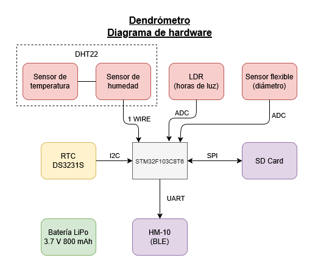
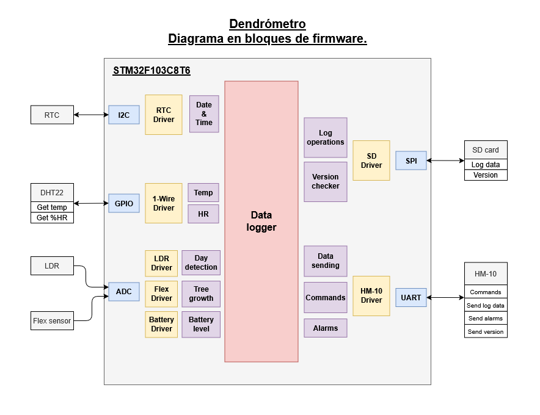
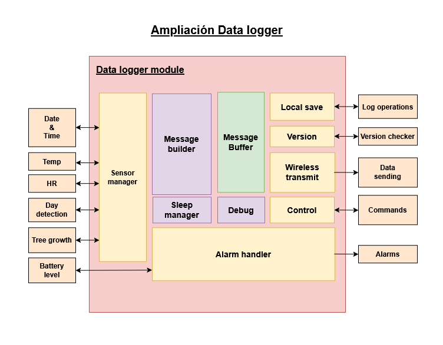

# Proyecto Final Integrador: Dendrómetro

Este repositorio contiene información sobre el diseño y desarrollo de un dendrómetro para el monitoreo del crecimiento de diferentes plantas. Dicho dispositivo se encarga principalmente de medir las variaciones de diámetro del tallo (o tronco) de las plantas, que estan intimamente relacionadas a la absorción / transpiración de agua por parte de las mismas, como así también otras variables ambientales que condicionan el crecimiento.

## Alcances del proyecto

El dendrómetro será básicamente un datalogger alimentado por batería, que tomará mediciones de distintas variables de forma periódica, para posteriormente enviarselas a un receptor (smartphone) utilizando un protocolo de comunicación inalámbrica. Entre las variables de interés a medir se encuentran:
- Variación de diámetro en el tallo o tronco.
- Temperatura.
- Humedad relativa.
- Intensidad luminosa (aunque lo que interesa son las horas de luz).

Dado que el dispositivo debe ser low power, la transmisión de datos se realizará utilizando BLE (Bluetooth Low Energy) para reducir el consumo, con un periodo de inactividad (en modo stand by) de 10 minutos entre medición y medición.

Asimismo, se contará con reloj de tiempo real para el manejo de tiempo y con una tarjeta SD para el guardado local de las métricas (a forma de backup en caso de contingencias).

Se tiene proyectado graficar las métricas enviadas al smartphone, ya sea en el mismo smartphone con una aplicación o utilizando a este último como "gateway" para visualizar los gráficos en una página web.

## Diagramas en bloques de HW / FW

A continuación se presentan los diagramas en bloques de hardware y firmware pertenecientes al dispositivo dendrómetro.

